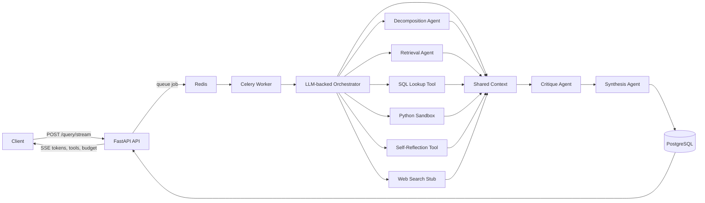

# System Diagram

## Flow 1 — simple structured query

**User:** `How many failed inspections did Chennai Plant have?`

1. The orchestrator sees a structured count over existing columns.
2. It routes to SQL only.
3. SQL returns the grounded count from `inspection_records`.
4. The synthesis agent drafts the answer.
5. The critique agent checks the draft claim against the SQL result already stored in shared context.
6. The final synthesis keeps the answer and emits provenance.

This shows the system does **not** over-route simple questions.

## Flow 2 — ambiguous analytical query

**User:** `Which plant looks worst this month?`

1. The orchestrator detects ambiguity in the word `worst`.
2. The decomposition agent creates dependent subtasks:
   - gather failure count, dangerous-issue count, and rework cost by plant
   - retrieve recurring free-text issue themes
   - combine metrics without reducing the answer to a single unsupported claim
3. SQL gathers structured metrics.
4. Retrieval pulls note evidence.
5. Python calculates a comparison score from gathered metrics.
6. The critique agent challenges overclaims such as `worst in every way`.
7. The synthesis agent returns a nuanced answer with sentence-level provenance.

This shows the agents doing genuinely different work when the request is ambiguous.

## Why free-text retrieval exists

The table deliberately does **not** expose a visible issue-category column.  
A query like `leakage` is broader than `water leakage`:

- `leakage` may include oil seep, oil drip, water seep, dampness, and moisture notes
- `water leakage` should narrow to wet/damp/water-related notes and exclude oil-only cases

The retrieval step interprets the semantic filter from short notes; SQL performs the final count over the matched records.
